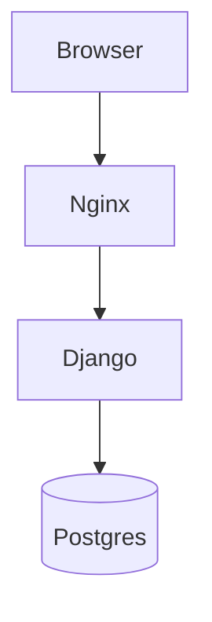

# Skill: Update Documentation

Use this skill when making code changes that require documentation updates.

## When to Use

- Architectural changes (always update `docs/ARCHITECTURE.md`)
- New addon (update `docs/ADDONS.md` and possibly create addon-specific doc)
- New agent or specialist (update `docs/AGENTS.md`)
- New Insight Function or MCP integration (update `docs/DATA_ACCESS.md`)
- Changes to deployment or infrastructure (update `docs/DEPLOYMENT.md`)
- Changes affecting how tests are written (update `docs/TESTING.md`)
- Security-relevant changes (update `docs/SECURITY.md`)

## Philosophy

Documentation is code. Treat it with the same discipline.

- **Accurate**: reflects current state, not aspirations
- **Concise**: no filler, no repetition
- **Discoverable**: titles and structure help people find info
- **Versioned**: changes tracked in git

## Document Responsibilities

Each doc has a clear scope:

| File | Scope |
|------|-------|
| `README.md` | Project overview, quick start |
| `CLAUDE.md` | Rules for Claude Code |
| `docs/ARCHITECTURE.md` | System design, layers, decisions |
| `docs/DEVELOPMENT.md` | Local setup, workflows, coding standards |
| `docs/DEPLOYMENT.md` | Production deploy, infra, rollback |
| `docs/ADDONS.md` | How to write an addon |
| `docs/AGENTS.md` | Agent Layer design |
| `docs/DATA_ACCESS.md` | Insight Functions, MCP, API clients |
| `docs/TENANCY.md` | Multi-tenancy conventions |
| `docs/TESTING.md` | Testing strategy |
| `docs/SECURITY.md` | Security practices |

If your change touches functionality covered by multiple docs, update all of them.

## Update Procedure

### 1. Identify affected docs

Before committing, ask: which docs does this change affect?

Examples:
- Added new LLM provider → `docs/AGENTS.md`
- Changed deployment script → `docs/DEPLOYMENT.md`
- Added Insight Function → `docs/DATA_ACCESS.md`
- Added addon → `docs/ADDONS.md` + addon-specific doc

### 2. Make doc changes in same PR as code

Docs and code belong together. Don't leave "docs TODO" for later.

### 3. Keep docs structured

Follow existing structure:
- H1 for doc title
- H2 for major sections
- H3 for subsections
- Code blocks with language specified

### 4. Use real examples

Don't invent hypothetical examples. Reference actual code (via cross-reference or snippets).

### 5. Cross-reference related docs

At the end of sections, link to related docs:
```markdown
For more, see [Addon Guide](ADDONS.md).
```

## Auto-Documentation

### Workflow

After push to `main`, GitHub Action `docs-auto.yml` runs:

1. Checks out the latest code
2. Runs Claude CLI with docs-generation prompt
3. Claude analyzes recent changes
4. Updates `docs/auto/` with generated content:
   - API reference
   - Architecture diagrams (Mermaid)
   - Changelog
5. If changes detected, opens PR to `docs/auto-update-YYYY-MM-DD` branch
6. Human reviews and merges

### What Goes in `docs/auto/`

- `docs/auto/api.md` — API endpoint documentation
- `docs/auto/architecture-diagram.md` — current architecture as Mermaid
- `docs/auto/changelog.md` — commits since last auto-docs update
- `docs/auto/insight-functions.md` — all registered Insight Functions with signatures

### What Stays in `docs/` (manual)

- All the main docs listed above
- Design decisions and rationales
- Anything requiring human judgment

## Writing Style

### Tone

- Direct and clear
- Second person ("you") when instructing
- First person plural ("we") when describing our decisions
- Active voice preferred

### Don'ts

- Don't use marketing language ("cutting-edge", "innovative")
- Don't use filler ("basically", "essentially", "simply")
- Don't assume context that isn't in the repo
- Don't leave TODOs ("to be documented later")

### Do's

- Use concrete examples
- Explain "why", not just "what"
- Link to related docs
- Update when code changes

## Markdown Conventions

### Headings

Start every doc with H1 title.

```markdown
# Topic

Optional intro paragraph.

## Major Section

### Subsection
```

### Code Blocks

Always specify language:

````markdown
```python
def example():
    pass
```
````

### Lists

Use `-` for unordered. `1.` for ordered.

### Links

Relative links to other docs:
```markdown
See [Architecture](ARCHITECTURE.md).
```

### Callouts

Use blockquotes for important notes:

```markdown
> **Note**: This feature requires tenant activation first.
```

## Diagrams

### When to Use

- Explaining architecture
- Request flow
- State machines
- Complex relationships

### How

Use Mermaid for diagrams (renders on GitHub):

````markdown

````

Or ASCII art for simple cases:
```
Browser → Nginx → Django → Postgres
```

## Versioning

Docs are versioned via git. No separate docs versioning.

If you need to document old behavior:
```markdown
> Before v0.3.0, this worked differently. See git history.
```

## Review

Docs PRs need review like code PRs.

Reviewer checks:
- [ ] Accurate (describes actual code behavior)
- [ ] Clear (can be understood by new developer)
- [ ] Consistent (with other docs)
- [ ] Complete (doesn't leave gaps)

## Common Documentation Tasks

### Adding a new doc

1. Create file in `docs/`
2. Add link to `README.md` under Documentation section
3. Update CLAUDE.md if Claude Code should know about it
4. Cross-reference from related existing docs

### Deleting obsolete docs

1. Remove the file
2. Remove references from `README.md`, `CLAUDE.md`, other docs
3. Add note in commit about what replaced it (if anything)

### Renaming a doc

1. Rename the file
2. Update all references (grep for old name)
3. Don't leave redirects — docs aren't user-facing URLs

## Verification Checklist

Before committing doc changes:

- [ ] Structure follows existing conventions
- [ ] Code examples tested (or clearly marked as illustrative)
- [ ] Links work (including relative links)
- [ ] No TODOs or placeholders
- [ ] Cross-references added
- [ ] Related docs also updated if affected
- [ ] Spelling and grammar checked
